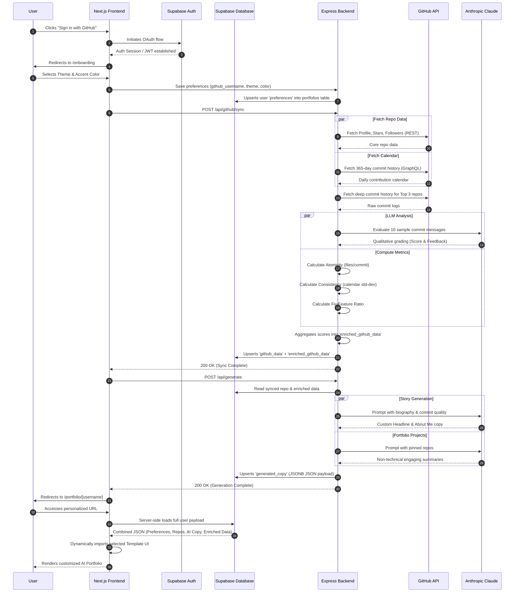

# GitFolio Complete Application Flow

This document details the end-to-end data flow and user journey for GitFolio, structured so you can easily translate it into a visual architecture map or flowchart.

## Architecture Flowchart (Mermaid)

---

## Detailed Step-by-Step Flow

### Phase 1: Authentication & Onboarding
1. **Trigger**: User visits `localhost:3000` and clicks the GitHub login button.
2. **Auth**: Next.js redirects to the Supabase GitHub OAuth Provider.
3. **Session**: Supabase succeeds and establishes an active JWT session.
4. **Redirect**: Frontend recognizes the login and routes the user to the `/onboarding` screen.
5. **Selection**: User picks their aesthetic: a specific frontend `templateId` (Default, Brutalism, Glassmorphism, Retro RPG) and a custom hex `accentColor`.
6. **Save**: The frontend sends these preferences to the backend, which upserts the data into the `preferences` column of the user's row in the `portfolios` database table.

### Phase 2: Core GitHub Synchronization
1. **Trigger**: Frontend automatically calls the backend `/api/github/sync` endpoint.
2. **Parallel Fetch 1 (REST)**: Backend hits the standard GitHub REST API endpoints to pull the user's bio, avatar, pinned repositories, and follower counts.
3. **Parallel Fetch 2 (GraphQL)**: Backend queries the GitHub GraphQL API to extract the user's precise 365-day Daily Contribution Calendar.

### Phase 3: Commit Quality & Enforcement
1. **Deep Fetch**: Using the repos found above, the backend fetches the actual raw commit history for the user's Top 3 most active repositories.
2. **Parallel Processing**:
   * **Algorithmic Math**: The Node.js server computes strict mathematical metrics such as *Commit Atomicity* (average files modified per commit), *Consistency* (standard deviations of commits over the year), and the *Fix-to-Feature Ratio*.
   * **LLM Qualitative Rating**: A chunk of 10 recent commit messages is sent to Anthropic's Claude 3.5. It evaluates how descriptive, concise, and helpful the messages are (grading adherence to Conventional Commits).
3. **Aggregation**: All these computed metrics are bundled together into an `enriched_github_data` JSON object.
4. **Storage**: The backend saves both the raw `github_data` and the `enriched_github_data` permanently into the Supabase database.

### Phase 4: Generative AI Copywriting
1. **Trigger**: Before moving to the final URL, the frontend calls the `/api/generate` endpoint.
2. **Data Ingestion**: The backend loads all the synced data from Phase 2 and Phase 3 out of the database.
3. **Parallel LLM Agents**:
   * **Identity Agent**: Claude acts as an HR/Recruiting expert. It reads the user's metrics and writes a highly engaging "About Me" section and a 1-sentence Catchy Headline.
   * **Project Agent**: Claude reads the technical details of the user's pinned repos and rewrites their descriptions to sound impressive and accessible to non-technical founders/recruiters.
4. **Storage**: The backend formats these strings into a valid JSON mapping and stores it inside the `generated_copy` column in Supabase.

### Phase 5: Client Rendering
1. **Routing**: The onboarding finishes, and the user is redirected to `/portfolio/[username]`.
2. **Server-Side Fetch**: Next.js fetches the *complete* user row from Supabase before the page loads so that SEO bots can read it.
3. **Template Injection**: A core structural component reads the user's `preferences.templateId` and dynamically lazy-loads the correct React file (e.g. `<RetroRpgTemplate />`).
4. **Final Render**: The template is populated with the AI-generated copy, the 365-day contribution heatmap, and the quality metrics, returning the final DOM to the user.
